# LLM 🤗 Who is the wolf? 🐺

This is a project used help LLM play. "Who is the wolf? "

## Game rule 
##### Play **Who is the wolf** with LLMs 🤖

###### Game Preparation
- **Role Assignment**: Among all players, one or two are randomly selected to be the "wolves," while the rest are "Civilians." The identities of the wolves and Civilians are kept secret from each other.
- **Word Selection**: All players are given the same word, but the wolves receive a different, related word. For example, if the Civilians' word is "apple," the wolves' word might be "fruit."

###### Game Process
- **Discribe Round**: Each player takes turns describing their understanding of the word. The wolves must try to blend in with the discussion without being discovered and may attempt to mislead other players.
- **Voting Round**: At the end of each round, all players vote to eliminate the person they believe is most likely to be a Spy. The player with the most votes is eliminated.
- **Victory Conditions**:
   - If the wolves are correctly identified and eliminated, the Civilians win.
   - If the number of wolves equals or exceeds the number of Civilians, the wolves win.
   - If the game is not finished within a certain period, it is considered a draw.

## Project profile

The project consists of three parts
- Code to help LLM play the game
- Human-AI interaction platform code
- Some necessary data in the game

### environment
- openai == 1.45.0 
- streamlit == 1.38.0 
- python-dotenv == 1.0.1
- httpx==0.24.1

## demo
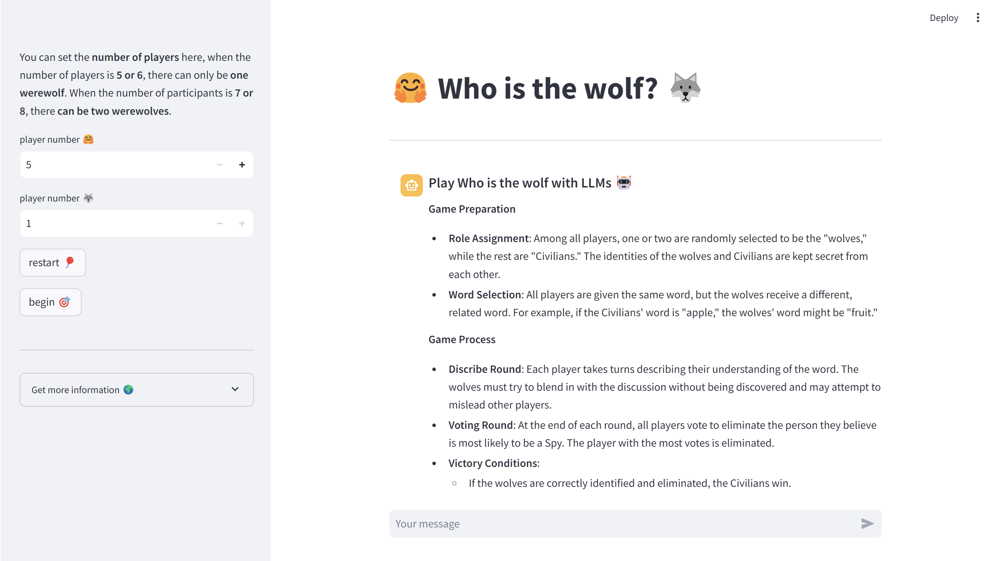

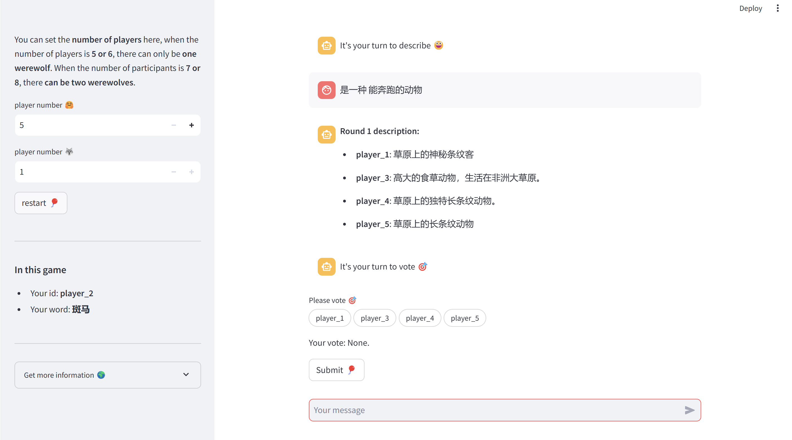

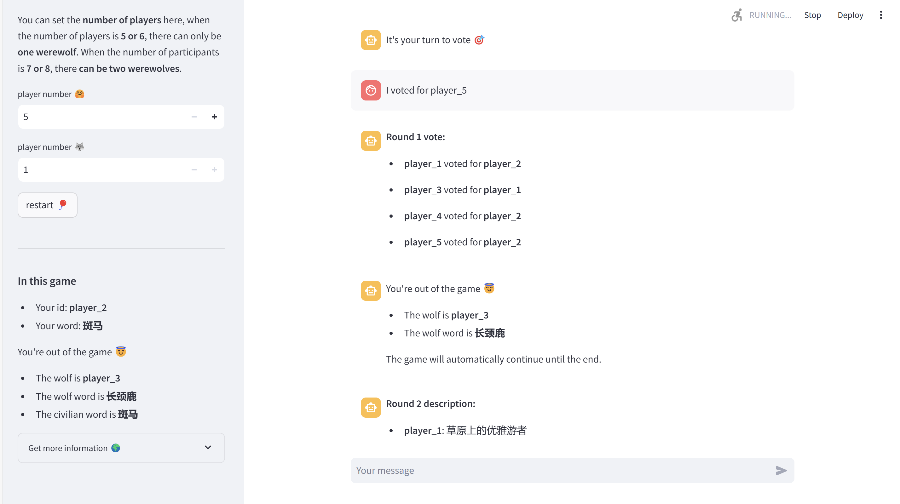

## some experiment reusults
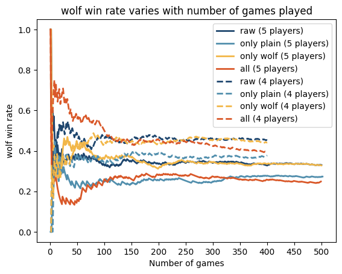
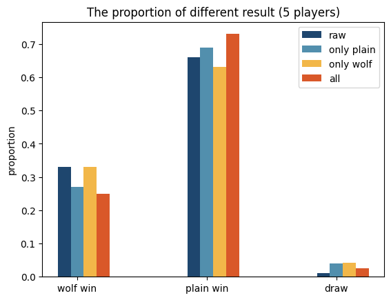
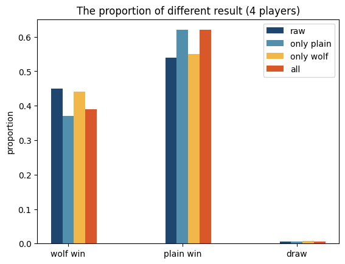
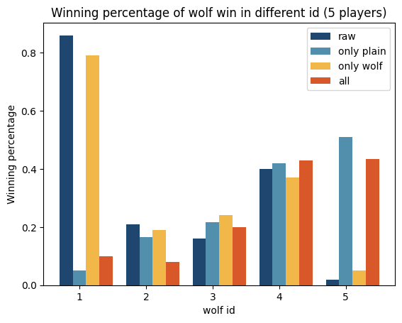
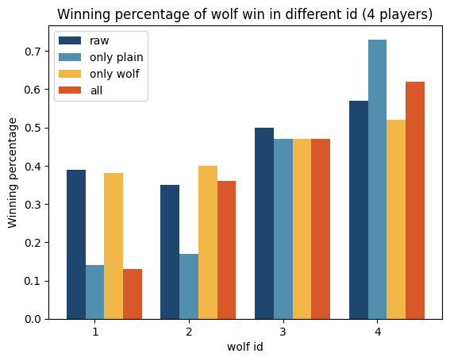
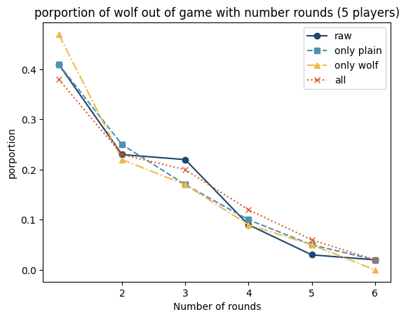
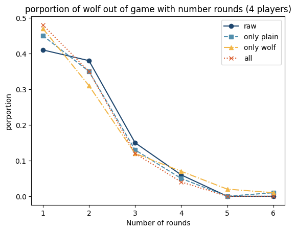
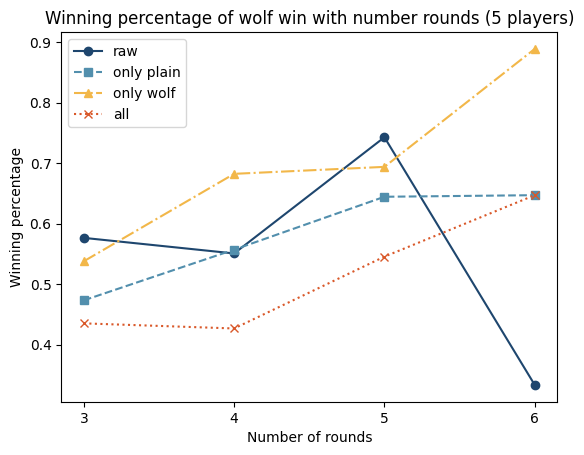
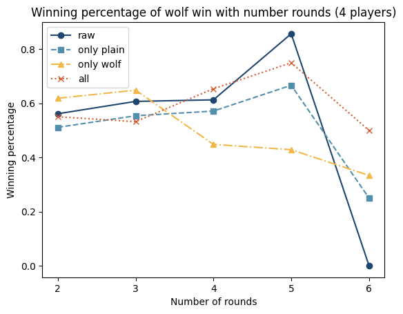

## contact
- Email: ysh020603@yeah.net
